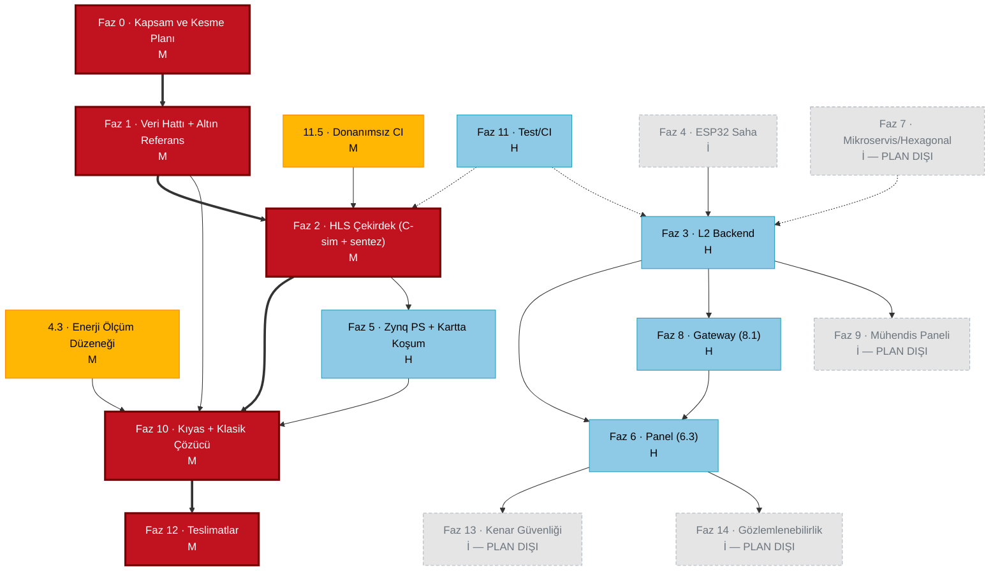

# Faz 0 — Bağımlılık Grafiği ve 14 Haftalık Takvim

**Oluşturma**: 2026-09-10 · **Durum**: ONAY BEKLİYOR

İlgili belgeler: [scope-triage.md](scope-triage.md) · [cut-plan.md](cut-plan.md)

---

## 1. Takvim çıpası

| Parametre | Değer |
|-----------|-------|
| Dönem başlangıcı | 2026-09-15 (Salı) |
| Hafta 1 (Pazartesi) | **2026-09-14** |
| Hafta 14 sonu | **2026-12-20** |
| Düşük kapasite haftaları | **H7, H8** (vize + hazırlık) · **H13, H14** (final + hazırlık) — ≈%40 kapasite |
| Resmi tatil | 29 Ekim 2026 (Perşembe) → H7 içinde |
| Kod dondurma | **H11 sonu** |
| Teslimat penceresi | H12 – H14 |
| Tamponlar | **H8** (Tampon 1) · **H11** (Tampon 2) |

> ⚠️ **Düzeltme**: Seçenek etiketinde "15 Eylül 2026 (Pazartesi)" yazıyordu; 15 Eylül 2026 aslında **Salı**. Hafta 1, 14 Eylül Pazartesi'den başlatıldı.

---

## 2. GÖREV 2 — Bağımlılık grafiği ve kritik yol



### Kritik yol (kalın kırmızı)

```
Faz 0 → Faz 1 → Faz 2 → Faz 10 → Faz 12
```

Bu zincirdeki **her hafta gecikmesi doğrudan teslim tarihine yansır**. Zincirin dışındaki hiçbir iş, zincirdeki bir işi geciktirme pahasına yapılmaz. Bu kural pazarlıksızdır.

### Kritik yolun en kırılgan halkası

**Faz 1 → Faz 2 geçişi.** Faz 2, Faz 1.3'ün altın referansı olmadan doğrulanamaz (Anayasa Prensip IV). Altın referans H2 sonunda hazır değilse, Faz 2'nin C-sim doğrulaması yapılamaz ve tüm zincir kayar. Bu yüzden **1.3, H2'nin ilk yarısına** çekilmiştir.

### Donanım/sentez beklerken paralel koşacak işler

Sentez turları uzun sürer (PYNQ-Z2 sınıfı için tur başına saatler). Sentez koşarken boş beklenmez:

| Sentez/derleme koşarken | Paralel iş | Neden bloklamıyor |
|-------------------------|-----------|-------------------|
| H3 — ilk C-sim/sentez | **10.1 Klasik çözücü** | Saf yazılım; hiçbir donanım çıktısına bağlı değil |
| H4 — sentez turu | **11.5 Donanımsız CI** | HLS'i CI'da koşturmak sentez sonucunu beklemez |
| H5 — bankalama iterasyonu | **4.3 Enerji ölçüm düzeneği** | INA219 kalibrasyonu FPGA tasarımından bağımsız |
| H6 — bitstream üretimi | **10.3 Ölçüm protokolü** | Protokol ölçümden **önce** yazılmalı (ön kayıt) |
| H9–H10 — kıyas koşumları | **12.1 Şekil biriktirme** | Her ölçüm çıktığında figür üretilir, sonda toplu değil |

---

## 3. GÖREV 3 — 14 haftalık takvim

**Sıralama kuralına uyum**: FPGA çekirdeği (Faz 2) H3–H6'da, Faz 1 H1–H2'de → *"Faz 1 ve Faz 2 ilk beş haftada"* kuralı karşılanıyor (Faz 2 H6'ya taşıyor, gerekçesi §3.1'de). Kaba CPU-vs-FPGA kıyası **H7 sonunda** elde. Faz 6/8 çekirdek ayakta durduktan sonra (H10) geliyor. Faz 13/14 taban plan dışı.

| Hafta | Tarih | Ana iş | Paralel iş | Hafta sonunda ELDE OLAN (somut) |
|-------|-------|--------|-----------|--------------------------------|
| **H1** | 14–20 Eyl | Faz 0 kapanışı (0.1 risk kaydı, 0.2 depo iskeleti, 0.7 CLAUDE.md) · **1.1** OSM veri hattı | Vitis HLS kurulumu · PYNQ imajı SD karta · Ders müfredat tarihi öğrenilir | Onaylı kapsam belgesi · Kart boot ediyor, Jupyter açılıyor · Deterministik OSM önbelleği |
| **H2** | 21–27 Eyl | **1.3** Altın referans QAOA (öne çekildi) · **1.2** QUBO derleyicisi | **2.0** bankalama tuzağı okunur · Ders hocasına bankalama sorusu sorulur | ✅ **Qiskit altın referansı koşuyor** · QUBO derleyici 16 kübite kadar üretiyor |
| **H3** | 28 Eyl–4 Eki | **2.1** Bellek bütçesi tablosu · **2.2** HLS çekirdek v1, C-sim | **10.1** Klasik çözücü (saf yazılım) | ✅ **C-sim Qiskit'e karşı fidelity ≥ 0.99** · 16 kübit BRAM bütçe tablosu |
| **H4** | 5–11 Eki | **2.2** İlk sentez turu — kaynak ve II raporu | **11.5** Donanımsız CI · Xilinx forumuna soru açılır | 🔴 **İLK SENTEZ RAPORU** (BRAM/DSP/LUT + II) — K-02/K-04 için veri |
| **H5** | 12–18 Eki | **2.2** Bankalama iterasyonu (deneme 1–3) | **4.3** INA219 enerji ölçüm düzeneği + kalibrasyon | Sentez hedefi tutuyor mu → evet/hayır için ölçülmüş veri |
| **H6** | 19–25 Eki | 🚦 **SENTEZ KARAR HAFTASI** · **5.1** fpga-agent + bitstream kartta | **10.3** Ölçüm protokolü yazılır (ön kayıt) | ✅ **Kartta koşan overlay** VEYA K-02/K-04 kesme kararı devrede |
| **H7** ⚠️ | 26 Eki–1 Kas | *Vize hazırlık + 29 Ekim tatili · %40 kapasite* · Kaba kıyas: tek eksen (gecikme) | Ağır iş açılmaz | 🎯 **7. HAFTA MİHENK TAŞI: CPU-vs-FPGA gecikme tablosu** |
| **H8** ⚠️ | 2–8 Kas | *Vize haftası · %40 kapasite* · 🛡️ **TAMPON 1** | Yalnızca kayan iş | Takvim yeniden hizalanmış · Yeni iş **açılmaz** |
| **H9** | 9–15 Kas | **5.3** Kıyas koşum matrisi · **10.3** protokole göre tam ölçüm turu | **3.1/3.2** Backend iskeleti (H) | Tam kıyas veri seti (gecikme + enerji) |
| **H10** | 16–22 Kas | **10.2** Karşılaştırma sunumu · **6.3** Mühendis konsolu · **8.1** Gateway | **12.1** Şekil biriktirme başlar | ✅ **Uçtan uca gösterilebilir demo** |
| **H11** | 23–29 Kas | 🛡️ **TAMPON 2** + 🔒 **KOD DONDURMA** · Tekrarlanabilirlik koşusu | Kalan H işleri (varsa) | 🔒 **Dondurulmuş depo + nihai ölçüm veri seti** |
| **H12** | 30 Kas–6 Ara | **12.2** Tez yazımı (bölüm bölüm) | **12.1** Figürler tamamlanır | Tez taslağı v1 — tam metin |
| **H13** ⚠️ | 7–13 Ara | *Final hazırlık · %40 kapasite* · **12.3** Sunum destesi + poster | Tez revizyonu | Sunum destesi · Poster baskıya hazır |
| **H14** ⚠️ | 14–20 Ara | *Final haftası · %40 kapasite* · **12.4** Demo videosu + jüri provası | — | ✅ **TESLİM** |

### 3.1 Sıralama kuralından sapma — gerekçe

Kural *"Faz 1 ve Faz 2 ilk beş haftada"* diyor. Takvimde Faz 2 **H6'ya** taşıyor. Gerekçe:

Faz 2'nin son adımı bir **karar** adımıdır (sentez tutuyor mu?), ve bu karar ancak en az bir tam sentez turu + bir iterasyon turu sonrası verilebilir. Bunları H3–H5'e sıkıştırmak, kararın **veriye değil takvime** dayanması demektir — bu Anayasa Prensip II'nin ruhuna aykırıdır. H6'ya taşınan şey Faz 2'nin işi değil, **kesme kararının kendisidir**; iş H3–H5'te bitmiştir.

Karşılığında 7. hafta mihenk taşı korunmuştur: kaba kıyas H7 sonunda elde edilir.

### 3.2 Düşük kapasite haftaları — açık muhasebe

H7, H8, H13, H14 ≈%40 kapasite → **≈2.4 haftalık kapasite kaybı**, takvimde peşinen fiyatlanmıştır. Bunun üstüne H8 ve H11 tam tampon olarak ayrılmıştır. Yani plan, 14 haftanın **≈9.4'ünü** gerçek iş için varsayar. Bu sayı iyimser değildir; tamponu kullanmayan plan yalan söyler.

### 3.3 H7 mihenk taşı neden vize haftasında?

Sıralama kuralı kaba kıyası 7. haftaya bağlıyor, ama H7 düşük kapasiteli. Çözüm: **işin kendisi H6'da yapılır**, H7 yalnızca *tabloyu çıkarma ve doğrulama* haftasıdır. H7'de yeni geliştirme açılmaz. Böylece hem kural karşılanır hem vize haftası korunur.

---

## 4. GÖREV 5 — Haftalık kontrol ritüeli

Her Cuma, 10 dakika. Çıktı `specs/000-kapsam-takvim/haftalik/HXX.md` dosyasına yazılır.

> Ritüel [docs/risk-register.md](../../docs/risk-register.md) **açılarak** başlar (adım 1): vadesi gelen satırlar
> kapatılır/tetiklenir, erken uyarı işareti görülenler `İZLENİYOR`'a çekilir, yeni risk varsa eklenir.
> Güncellenmeyen risk kaydı, risk kaydı değildir.

```markdown
# Hafta XX kontrolü — <tarih>

## 1. Risk kaydı ve kesme tetikleri (4 dk)
*docs/risk-register.md açık olarak doldurulur — K-XX tetikleri zaten o kaydın satırlarıdır.*
- Bu hafta vadesi gelen risk/tetik: <ID'ler / yok>
- Ölçüt tuttu mu: <evet / hayır / henüz ölçülmedi>
- `AÇIK` → `İZLENİYOR` geçen (erken uyarı işareti görüldü): <ID / yok>
- `TETİKLENDİ` olan: <ID / yok> → cut-plan.md'de yazılan uygulanıyor
- Yeni eklenen risk: <ID / yok>
- risk-register.md "Son güncelleme" satırı değiştirildi mi: <evet/hayır>

## 2. Takvim sapması (3 dk)
- Bu haftanın planlanan çıktısı: <schedule.md'den kopyala>
- Fiilen elde olan: <...>
- Sapma: <0 / yarım hafta / 1 hafta+>

## 3. Tampon muhasebesi (2 dk)
- Tampon 1 (H8): <dokunulmadı / X gün yendi>
- Tampon 2 (H11): <dokunulmadı / X gün yendi>
- 🔴 Toplam 1 haftadan fazla yendiyse: H kümesinden kesme BAŞLAT (cut-plan.md §3 sırası)

## 4. Gelecek hafta (1 dk)
- Gelecek hafta verilecek karar: <...>
- Gelecek hafta vadesi gelen tetik: <K-XX>
- Onay kapısı gereken var mı (Prensip I): <evet/hayır — varsa karşılaştırma tablosu hazırla>
```

**Kırmızı çizgi**: Üst üste iki hafta sapma "1 hafta+" ise, o hafta yeni iş açılmaz; yalnızca kesme yapılır.
